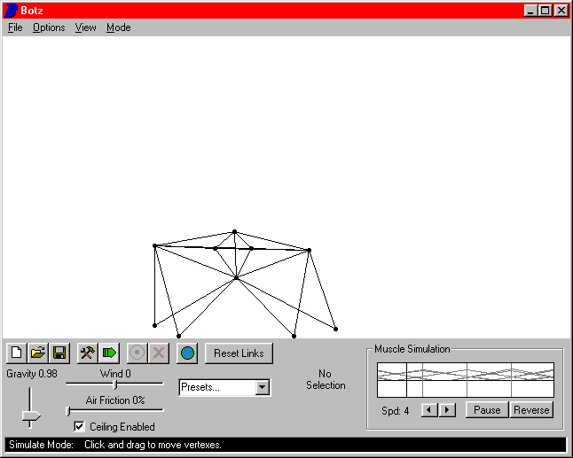



## Botz 1\.1

### Description

Botz is an addictive 2D-Robot creation utility. With it, you can design your own Robots that walk, crawl, roll, or bounce. If you can get the hang of it, its very addictive! Special thanks to MaskingTape for help with the fullscreen code! The Botz homepage is now up, at: http://members.theglobe.com/SilverBolt01/index.html
 
### More Info
 
Required: MS Common Dialog Control 6.0, MS Windows Common Controls-2 6.0, Visual Basic 6.0

             |
---                |---
**Submitted On**   |2000-05-31 09:54:24
**By**             |[Kevin Laity](https://github.com/Planet-Source-Code/PSCIndex/blob/master/ByAuthor/kevin-laity.md)
**Level**          |Advanced
**User Rating**    |4.8 (196 globes from 41 users)
**Compatibility**  |VB 5\.0, VB 6\.0
**Category**       |[Games](https://github.com/Planet-Source-Code/PSCIndex/blob/master/ByCategory/games__1-38.md)
**World**          |[Visual Basic](https://github.com/Planet-Source-Code/PSCIndex/blob/master/ByWorld/visual-basic.md)
**Archive File**   |[CODE\_UPLOAD62605312000\.zip](https://github.com/Planet-Source-Code/kevin-laity-botz-1-1__1-8409/archive/master.zip)

